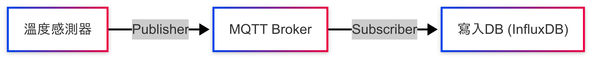

# MQTT 溫度記錄器

使用情境：記錄溫度感測器測量值，並回寫資料庫供後續分析與即時顯示。此架構供後續擴充感測器

說明：基於 MQTT 協議進行資料傳輸管理，且所有服務轉為容器化方便佈署

- 主機: Broker & DB

  建立MQTT BROKER與InfluxDB

- 感測器節點: Publisher & Subscriber

  Publisher: 將測量值發布至BROKER

  Subscriber: 監聽對應TOPIC執行後續功能 (此處以回寫DB為例)


# 快速啟動

## 專案結構

```
MqttTemperatureMonitor
│  
├─broker                # Broker
├─publisher_max6675     # Pub: 讀取感測器並發布至Broker
├─rpi_script            # Raspberry Pi 快速啟動script
└─subscriber_db         # Sub: 訂閱主題並回寫DB
```

## 主機

1. broker資料夾移至佈署主機，以路徑`home/user/MqttTemperatureMonitor/broker`為例

2. 修改.env參數

3. 執行`docker compose up -d`

4. 檢查InfluxDB是否啟動: `http://server-ip:8086`

## 感測器節點

1. publisher_max6675, subscriber_db資料夾移至佈署主機，以路徑`home/user/MqttTemperatureMonitor/publisher_max6675, subscriber_db`為例

2. 分別修改資料夾內.env參數

3. 分別啟動`docker compose up -d`

4. (Optional) rpi_script的script放入`home/user/MqttTemperatureMonitor`，使用start/stop全部啟動與停止

# 架構圖




# 硬體串接說明

使用MAX6675，連接至Raspberry Pi 3B+

| 項目 | GPIO   | 備註                |
| ---- | ------ | ------------------- |
| VCC  | 3.3V   |                     |
| GND  | GND    |                     |
| SCK  | GPIO11 | 時鐘(SCLK)          |
| CS   | GPIO8  | Chip Select         |
| MISO | GPIO9  | Master In Slave Out |
